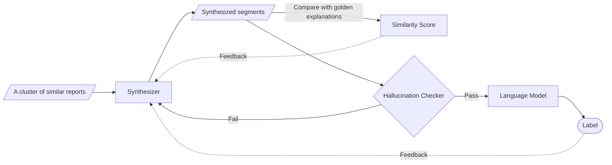
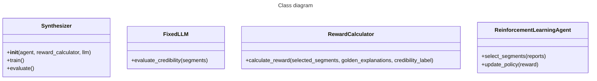

# Thesis-test-code

## Some diagrams
- Pipeline

```mermaid
flowchart LR
    Input@{ shape: lean-r, label: "A cluster of similar reports" }--> Synthesizer
    Synthesizer --> output@{ shape: lean-r, label: "Synthesized segments" }
    output -->|Compare with golden explanations| similarity_score[Similarity Score]
    output -->  hallu_check@{ shape: diamond, label: "Hallucination Checker" }
    similarity_score -. Feedback .-> Synthesizer
    hallu_check -->|Pass| LLM[Language Model]
    hallu_check -->|Fail| Synthesizer
    LLM --> label([Label])
    label -. Feedback .-> Synthesizer
```

- Class diagram

```mermaid
---
title: Class diagram
---
classDiagram
    class Synthesizer {
        +__init__(agent, reward_calculator, llm)
        +train()
        +evaluate()

    }

    class FixedLLM {
        +evaluate_credibility(segments)
    }
    class RewardCalculator {
        +calculate_reward(selected_segments, golden_explanations, credibility_label)
    }
    class ReinforcementLearningAgent {
        +select_segments(reports)
        +update_policy(reward)
    }
    
    %% DataProcessor <|-- Synthesizer
    %% FixedLLM <|-- Synthesizer
    %% RewardCalculator <|-- Synthesizer
    %% ReinforcementLearningAgent <|-- Synthesizer
```